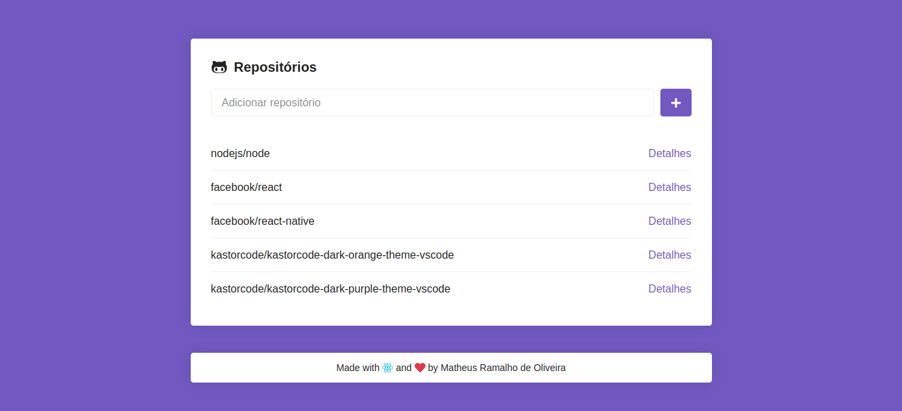
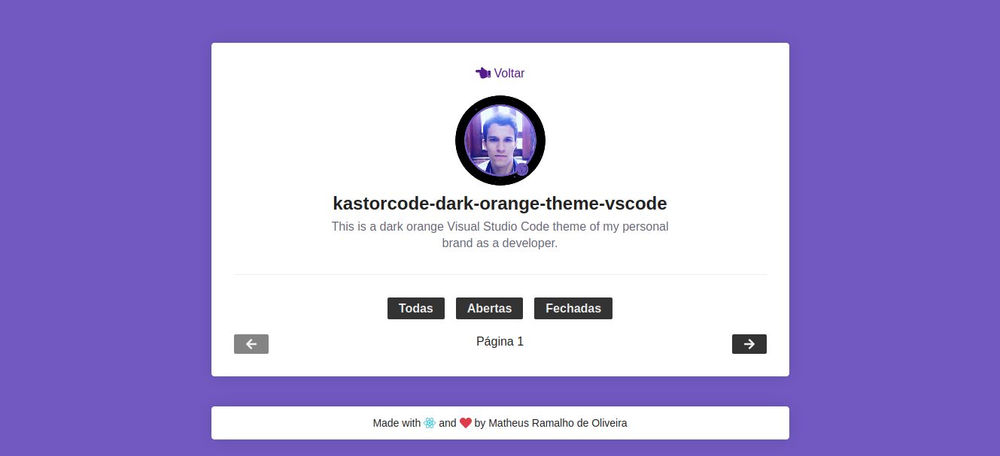
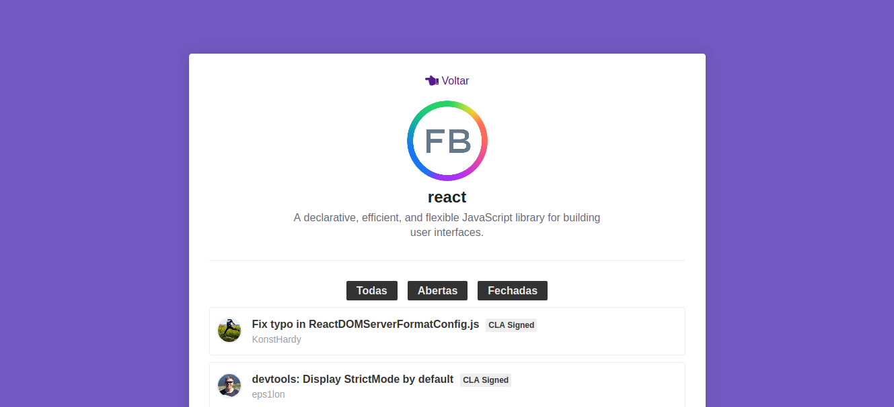
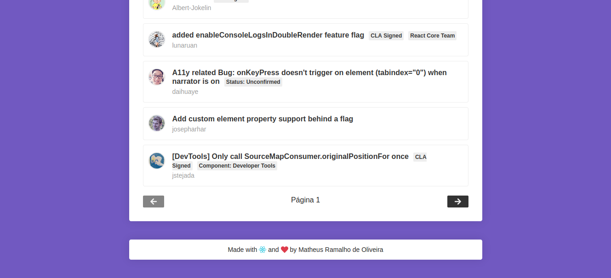

## GoStack Bootcamp Challenge 5
> 🚀 Practical project of the [Rocketseat](https://rocketseat.com.br) GoStack Bootcamp.  
👷 Developed by Matheus Ramalho de Oliveira.  
🔨 Systems Analyst, Full-Stack Developer.  
🏡 Goiânia, Goiás, Brasil.  
✉️ kastorcode@gmail.com  
👍 [instagram.com/kastorcode](https://www.instagram.com/kastorcode)

---

### Screenshots

<p align="center">
  
</p>
<p align="center">
  
</p>
<p align="center">
  
</p>
<p align="center">
  
</p>

---

<p align="center">
  
</p>
<p align="center">
    Challenge 5: First project with ReactJS
</p>

---

## :rocket: Sobre o desafio

Nesse desafio você adicionará novas funcionalidades na aplicação que desenvolvemos ao longo desse módulo.

### Funcionalidades

#### 1. Captando erros

Adicione um `try/catch` por volta do código presente na função `handleSubmit` presente no componente `Main` e caso um repositório não seja encontrado na API do Github adicione uma borda vermelha por volta do input em que o usuário digitou o nome do repositório.

#### 2. Repositório duplicado

Antes de fazer a chamada à API na função `handleSubmit` faça uma verificação para ver se o repositório não está duplicado, ou seja, se ele ainda não existe no estado de `repositories`.

Caso exista, dispare um erro, e com isso o código cairá no `catch` do `try/catch` criado na funcionalidade anterior.

```js
throw new Error('Repositório duplicado');
```

#### 3. Filtro de estado

Adicione um filtro de estado na listagem de Issues que criamos no detalhe do repositório. O estado representa se a issue está em aberto, fechada ou uma opção para exibir todas.

Exemplos de requisição:

```
https://api.github.com/repos/rocketseat/unform/issues?state=all
https://api.github.com/repos/rocketseat/unform/issues?state=open
https://api.github.com/repos/rocketseat/unform/issues?state=closed
```

Você pode encontrar a documentação [nesse link](https://developer.github.com/v3/issues/#parameters-1);

#### 4. Paginação

Adicione paginação nas issues listadas no detalhe do repositório. A API do Github lista no máximo 30 issues por página e você pode controlar o número da página atual por um parâmetro no endereço da requisição:

```
https://api.github.com/repos/rocketseat/unform/issues?page=2
```

Adicione apenas um botão de próxima página e página anterior. O botão de página anterior deve ficar desativado na primeira página.

---

### 🗓 ️Roadmap
- Introduction to Node.js
- Creating Node.js project
- Continuing Node.js project
- CSS Flexbox
- UI Design
- Introduction to React
- First project with ReactJS
- First project with React Native
- Front-end documentation
- Flux architecture
- Using React Hooks
- Server-side rendering(SSR) with ReactJS
- GraphQL
- Expo
- Creating ReactJS project
- Creating React Native project
- Animations with React Native
- Full-stack app development
- Node.js tests
- Node.js deploy
- ReactJS tests
- React Native tests
- ReactJS deploy
- React Native publication
- WebSocket with Express
- Advanced patterns at Node.js
- OmniStack SaaS(software as a service) and AdonisJS
- Final challenge
- Monorepo
